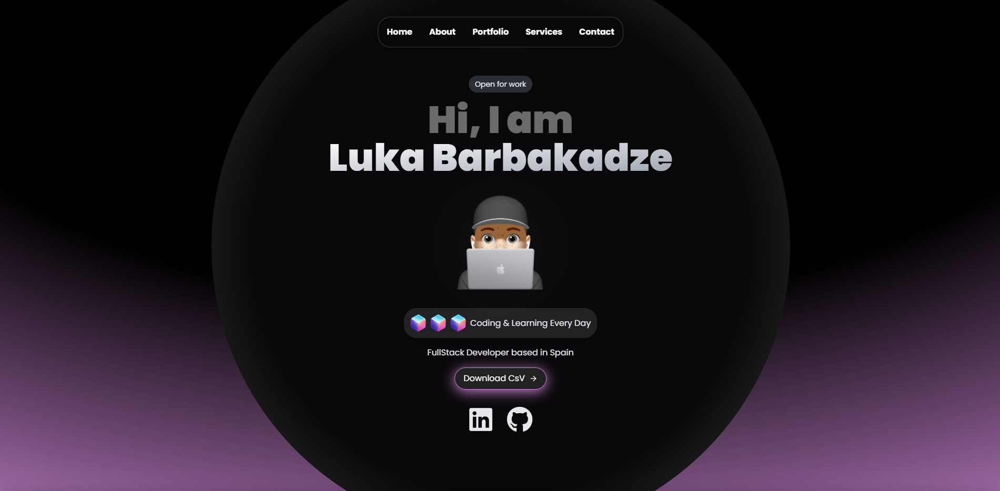

# Modern Portfolio 🚀✨

This is a **modern web portfolio** built with **TypeScript**, **Tailwind CSS**, and enhanced with **smooth animations** for an engaging user experience. 🎨💻

## Features 🌟
- **Fully Responsive**: Adapts to all screen sizes 📱💻.
- **Smooth Animations**: Dynamic transitions for an interactive feel 🎬.
- **Fast and Lightweight**: Optimized for top performance ⚡.
- **Modular Components**: Easily customizable and extendable 🛠️.

## Technologies Used 🏗️
- **TypeScript**: Strongly-typed JavaScript for maintainability 📝.
- **Tailwind CSS**: Utility-first styling for rapid development 🎨.
- **Framer Motion**: Smooth and customizable animations 🏃.
- **React**: Enables reusable components ⚛️.

## Installation and Usage 🚀
1. Clone this repository:
   ```sh
   git clone https://github.com/DevLukab/modern-portfolio.git
   ```
2. Navigate to the project folder:
   ```sh
   cd your-repository
   ```
3. Install dependencies:
   ```sh
   npm install
   ```
4. Run the development server:
   ```sh
   npm run dev
   ```

## Preview 👀


## Contact 📬
If you would like to contact me, you can reach me through:
- Email: [dev.lukab@gmail.com](mailto:dev.lukab@gmail.com)
- LinkedIn: [https://www.linkedin.com/in/luka-barbakadze-78b9352b8/](https://www.linkedin.com/in/luka-barbakadze-78b9352b8/)

Thanks for visiting my portfolio! 🚀🎨